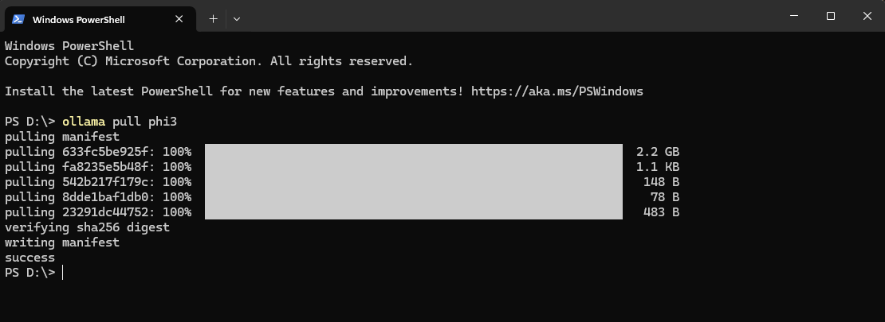

# Otto AI Desktop Assistant


*Otto* is a powerful, multi-modal AI desktop assistant for Windows, inspired by JARVIS. It runs silently in the background, accepting both voice and text commands to help you manage your system, stay productive, and access real-time information.

---

## 🚀 Download & Installation

Get the latest version of Otto Assistant here:

**[➡ Download Otto-Setup.exe (v1.0.0) ⬅](https://github.com/ShivanshTripathi247/Otto/releases/tag/v1.0.0)**


Simply run the downloaded Otto-Setup.exe. The installer will guide you through the process, which includes:
1.  Installing the Otto Assistant application.
2.  Installing the Ollama AI engine, which powers the assistant.
3.  On the first run, the assistant will automatically download the required phi-3 AI model from your terminal. This is a one-time setup and may take a few minutes depending on your internet connection.
4. close the terminal once you see this in your terminal.

5. If you face any error during phi-3 installation in your terminal, run this command to install it successfully
```bash
ollama run phi3
```

6. Enjoy your new AI powered desktop assistant using hotkey
```ctrl + space```
---

## ✨ Features

Otto is packed with features to enhance your productivity and desktop experience:

* *Multi-Modal Commands:* Interact with Otto using your preferred method:
    * *Text Command Palette:* Press Ctrl+Space to type a command.
    * *Voice Commands:* Press Ctrl+Alt+Space to speak your command.
* *AI-Powered Intent Recognition:* Powered by a locally-run Phi-3 LLM, Otto understands natural language commands.
* *System Control:*
    * Change your desktop wallpaper.
    * Get live CPU and RAM usage reports.
    * Launch any application on your system (e.g., "launch notepad").
* *API Integrations:*
    * *Real-Time Weather:* Get current weather updates for any city.
    * *Google Calendar:* Check your upcoming appointments and schedule.
* *Dashboard UI:* A clean and modern dashboard to access features, view system stats, and launch apps/websites.
* *Text-to-Speech:* Otto speaks its responses out loud for a true assistant experience.
* *System Tray Operation:* Runs silently in the background with a convenient system tray icon for access to the dashboard and other options.

---

## 🛠 How to Use

Once installed, Otto runs in the background.

* *Open Command Palette (Text):* Ctrl + Space
* *Activate Voice Listening:* Ctrl + Alt + Space
* *Access Dashboard:* Right-click the Otto icon in your system tray and select "Dashboard".

### Example Commands:
* "What's the weather like in Chennai?"
* "Change my desktop background."
* "What's on my schedule today?"
* "Launch Chrome."
* "Open google.com."
* "What is my current CPU load?"

---

## 👨‍💻 For Developers: Building from Source

If you wish to run or modify the project from the source code, follow these steps.

### Prerequisites
* Python 3.10+
* An active internet connection for the first-time setup.
* API keys for external services (see below).

### 1. Clone the Repository
```bash
git clone https://github.com/ShivanshTripathi247/Otto.git
cd Otto